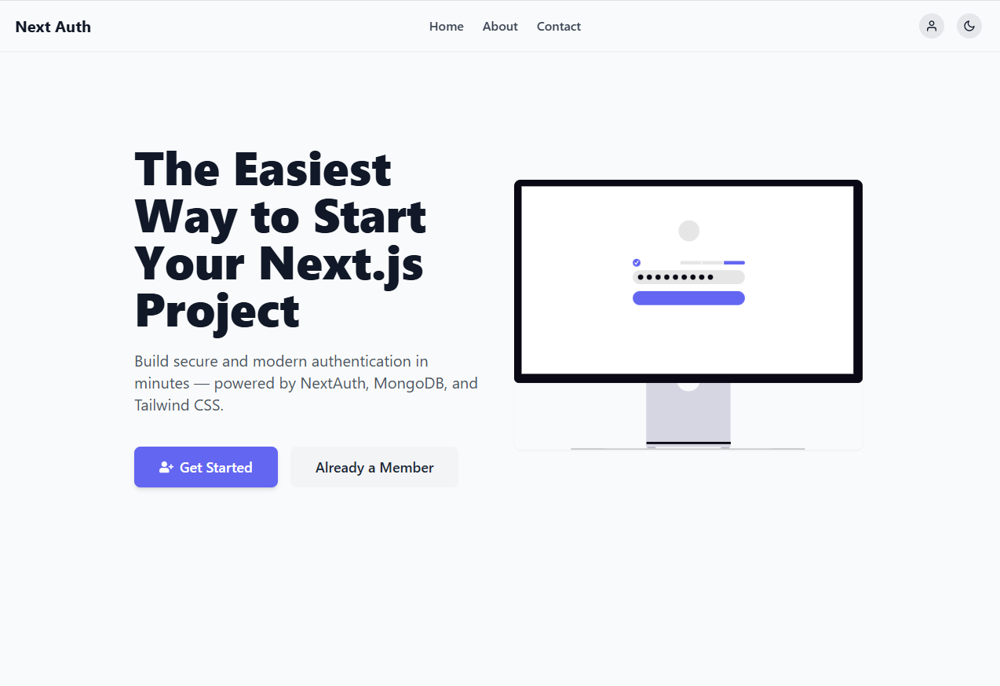
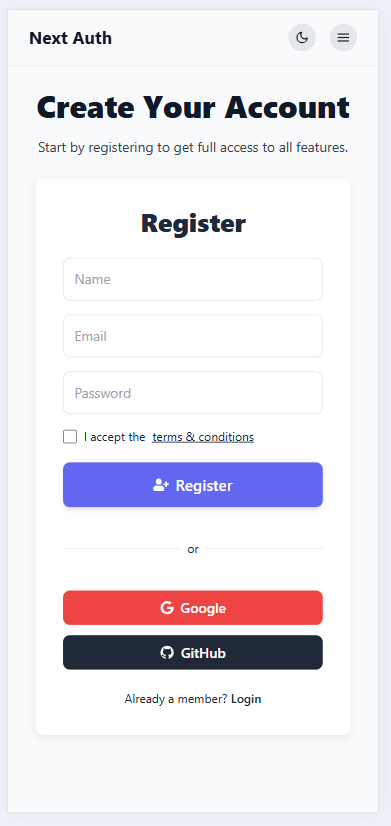

# NextJS Auth Starter


A professional and minimal **Next.js starter** with **TailwindCSS**, **dark mode**, and built-in **authentication**. Ideal for quickly starting projects, prototyping features, or testing secure auth flows without building everything from scratch.

## Live Demo

Check out the live demo here: [Next.js Auth Starter Demo](https://nextjs-auth-starter-red.vercel.app/)

---

## 📸 Screenshots

### Home / Landing Page



### Auth Form / Register



## About This Project

**NextJS Auth Starter** is a lightweight, modern, and fully responsive authentication boilerplate for **Next.js**, **TypeScript**, and **MongoDB**.

It focuses on:

- **Simplicity**: Minimal and clean code for faster development.
- **Scalability**: Easy to extend and integrate with new features.
- **Developer Experience**: Ready-made auth system, OAuth, email/password, and password recovery.

Perfect for building secure apps quickly or prototyping new features without re-implementing a full authentication system.

## Features

- **Next.js 16+ App Router** – Modern routing system.
- **TailwindCSS 3.x** – Fully responsive and customizable.
- **Dark Mode Support** – Toggleable light/dark themes.
- **Authentication Ready** – NextAuth, OAuth (Google, GitHub), email/password.
- **Forgot Password Flow** – Reset user password securely.
- **Responsive Design** – Optimized for mobile, tablet, and desktop.
- **Minimal & Professional Layout** – Clean starter for projects or portfolios.
- **Email Integration** – Example contact form with Nodemailer.
- **TypeScript Ready** – Fully typed for better developer experience.

## Installation

1. Clone the repository:

```bash
git clone https://github.com/mehdi-zayani/nextjs-auth-starter.git
```

2. Install dependencies:

```bash
npm install
```

3. Run the development server:

```bash
npm run dev
```

4. Open http://localhost:3000 in your browser.

## Project Structure

```bash
nextjs-auth-starter/
├─ public/                     # Static assets (images, icons)
├─ src/
│  ├─ app/
│  │  ├─ layout.tsx           # Root layout with TailwindCSS and dark mode
│  │  ├─ .../                 # Folders for pages like about contact dashboard
│  │  ├─ page.tsx             # Home / landing page
│  │  ├─ api/                 # API routes (auth, contact)
│  ├─ components/             # Reusable UI components (Card, Navbar, Hero, etc.)
│  │  ├─auth/                 # contain the Authentication Form for login and register
│  │  ├─header/               # Navbar mobile menu
│  │  ├─ui/                   # UI components button cards ...
│  │  └─ sections/            # Page sections only hero for now
│  ├─ styles/
│  │  └─ globals.css          # Tailwind base + global styling
│  ├─lib/                     # Utility functions (sendMail, etc.)
│  ├─providers/
│  ├─services/                # Authentication Service
├─ .gitignore
├─ package.json
├─ tsconfig.json               # TypeScript configuration
├─ next.config.js              # Next.js configuration
├─ tailwind.config.js          # Tailwind configuration
├─ postcss.config.js           # PostCSS configuration
├─ README.md


```

## Features

- **Next.js 16+ App Router** – Modern routing with server components support.
- **TailwindCSS 3.x** – Utility-first styling with responsive design and dark mode support.
- **Dark Mode** – Class strategy toggle for light/dark theme.
- **Authentication Ready** – Built-in support for NextAuth, OAuth, and email/password flows.
- **Responsive UI Components** – Cards, forms, hero sections, buttons, and layouts ready to use.
- **Password Recovery Flow** – Forgot password and reset password functionality.
- **Email Sending** – Integrated contact form with Nodemailer setup (dev & production ready).
- **Minimal & Professional Design** – Clean layouts suitable for starters or portfolios.
- **Extensible** – Easy to add more pages, sections, or auth providers.
- **TypeScript Support** – Fully typed for safer and faster development.

## Configuration

Before running the project in production or connecting real services, configure the following environment variables in a `.env.local` file:

```env
# MongoDB
MONGODB_URI=your_mongodb_connection_string

# NextAuth
NEXTAUTH_SECRET=your_random_secret
NEXTAUTH_URL=http://localhost:3000

# SMTP (for contact form / email features)
SMTP_HOST=smtp.example.com
SMTP_PORT=587
SMTP_USER=your_email@example.com
SMTP_PASS=your_email_password
```

- Adjust the values according to your environment. The starter comes with default development settings using a test SMTP account.

## Contributing

Contributions are welcome! Follow these steps to help improve the starter:

1. Fork the repository
2. Create a feature branch (`git checkout -b feature/your-feature`)
3. Commit your changes (`git commit -m "feat: add your feature"`)
4. Push to the branch (`git push origin feature/your-feature`)
5. Open a Pull Request

Please adhere to the existing code style and keep commits clean and descriptive.

## License

This project is licensed under the MIT License. See the [LICENSE](LICENSE) file for details.
